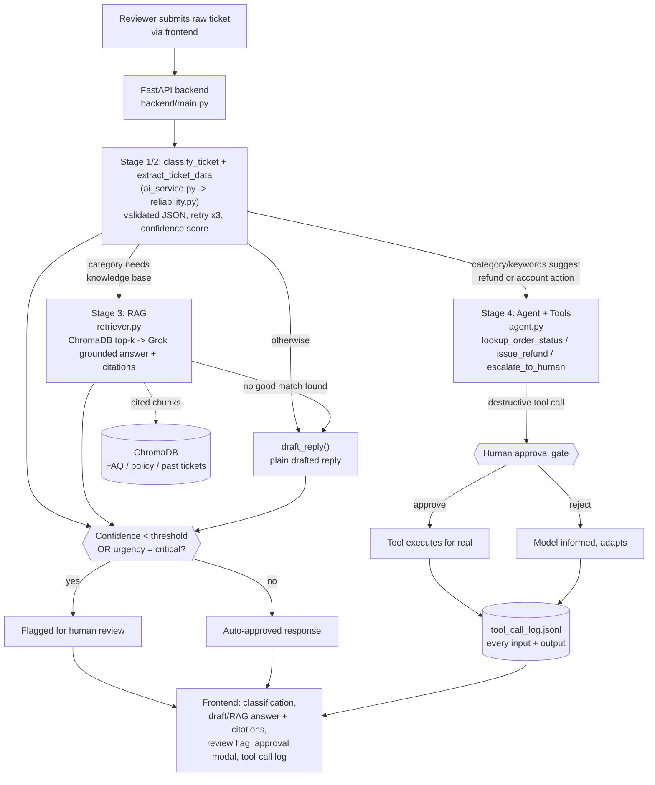

# Architecture

One page, top to bottom: a ticket comes in, gets classified, optionally
grounded against the knowledge base, optionally handed to the tool-calling
agent, and anything uncertain or destructive stops for a human.

## Component notes

- **Stage 1/2 (`ai_service.py` + `reliability.py`)** - every AI call goes
  through `call_structured()`, which asks Grok for JSON, validates it against
  a Pydantic schema, retries up to 3x on failure, and raises a caught
  `StructuredGenerationError` (never a raw crash) if it still can't get valid
  output. Every schema carries a `confidence` field.
- **Stage 3 (`knowledge_base/`)** - docs are chunked by markdown section,
  embedded locally with `sentence-transformers` (no API cost for embeddings),
  and stored in a persistent local ChromaDB collection. Answers are
  generated only from retrieved chunks, and citations are cross-checked
  against what was actually retrieved before being returned to the UI.
- **Stage 4 (`agent/`)** - a real OpenAI-style tool-calling loop against
  Grok. `issue_refund` is the one destructive tool; the loop pauses and
  returns `status: pending_approval` instead of executing it, and only
  proceeds after `/api/agent/approve` is called. Every tool call (auto or
  approved/rejected/errored) is appended to `backend/logs/tool_call_log.jsonl`.
- **Stage 5 (`pipeline.py`)** - the single function the frontend's main
  "Process Ticket" flow calls: classify -> retrieve if it's a knowledge
  question -> draft or flag for agent action -> compute an overall confidence
  and apply the review gate (also force-flagging anything urgency=critical,
  per `backend/knowledge_base/docs/policy.md`).
- **Frontend (`frontend/`)** - a static HTML/CSS/JS single page. The
  left-hand pipeline rail lights up each stage live as a ticket moves
  through it; results render as cards (classification, extracted data,
  grounded answer + citation chips, or agent tool-call thread with an
  inline approve/reject control); a live log panel mirrors
  `tool_call_log.jsonl`.
